# Processed Electric Sheep Dreams


[](https://huggingface.co/Tongyi-MAI/Z-Image-Turbo)
[](https://huggingface.co/Abrahamm3r/Z-Image-SDNQ-uint4-svd-r32)

A native desktop application for fast AI image generation with **multiple model options**. Choose between the base Z-Image-Turbo model or the optimized SDNQ-quantized version for maximum efficiency. Supports Text-to-Image, Image-to-Image transformation, and Inpainting with mask-based editing.

## Architecture Overview

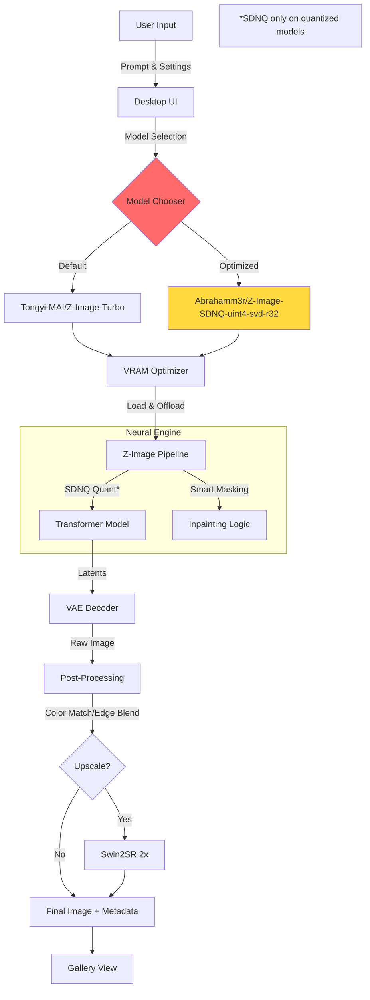

With accurate text and subject rendering. Includes a MOAP (Mother of All (negative) Prompts) for better rendering.

---

## ⚡ Model Selection

**NEW**: Choose your preferred model in the Advanced Configuration section!

| Model | Description | Speed | VRAM Usage | Size |
|-------|-------------|-------|------------|------|
| **Tongyi-MAI/Z-Image-Turbo** | Base model with full precision where needed | Fast | ~6GB | ~5GB |
| **Abrahamm3r/Z-Image-SDNQ-uint4-svd-r32** | Optimized with 4-bit quantization (by @Abrahamm3r) | Faster | ~4GB | ~3GB |

### How to Switch Models

1. Launch the application
2. Open **Advanced Configuration** (expand the section)
3. Select your preferred model from the **Model** dropdown
4. The selected model will load on startup

> **Note**: Changing the model requires restarting the application. The model selection persists during each session.

---

## ⌨️ Shortcuts

| Key | Action |
|-----|--------|
| `Enter` | Trigger generation (when in prompt box) |
| `Ctrl+S` | Save generated image |
| `Ctrl+C` | Copy prompt to clipboard |
| `Esc` | Cancel current generation |
| `Scroll` | Zoom in/out of viewport |

---

## Screenshots

### Main Interface
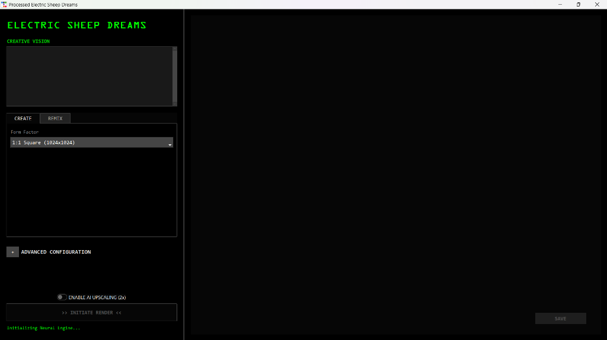

### Prompt Entry with Advanced Configuration
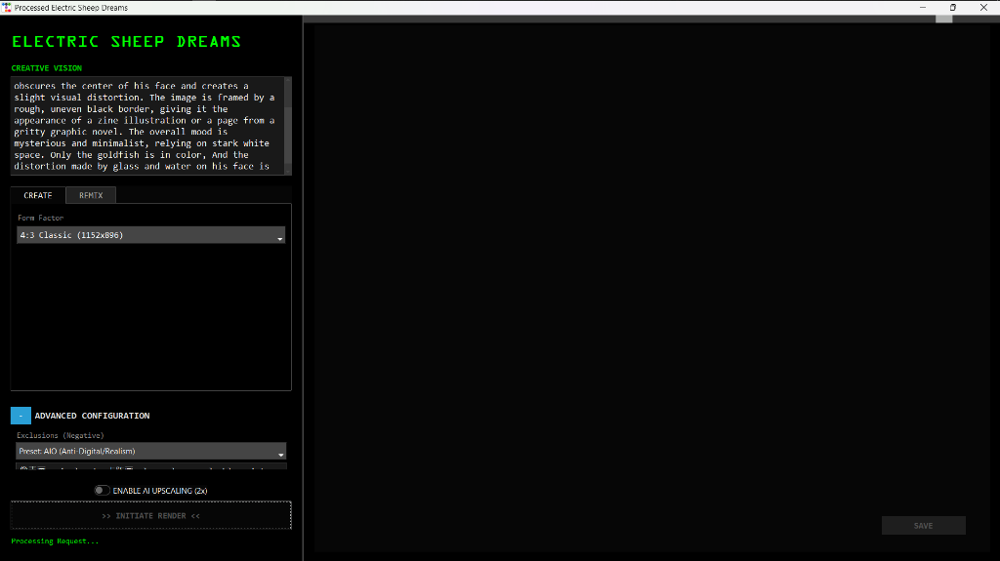

### Generated Result
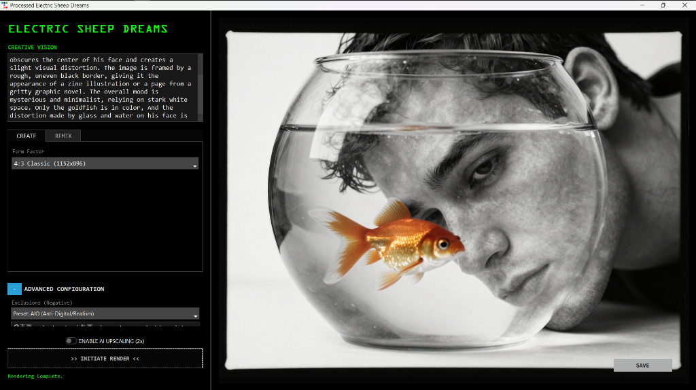

---

## Gallery

Sample images generated with Processed Electric Sheep Dreams:

<table>
  <tr>
    <td>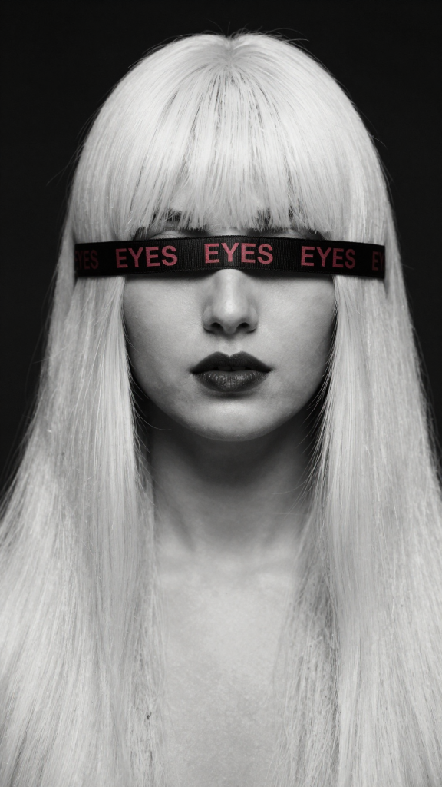</td>
    <td>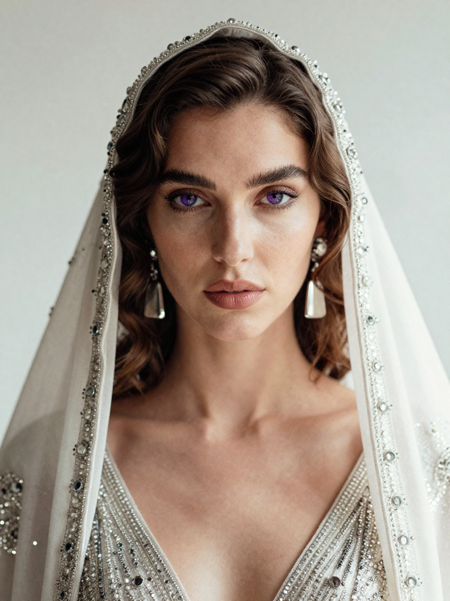</td>
    <td>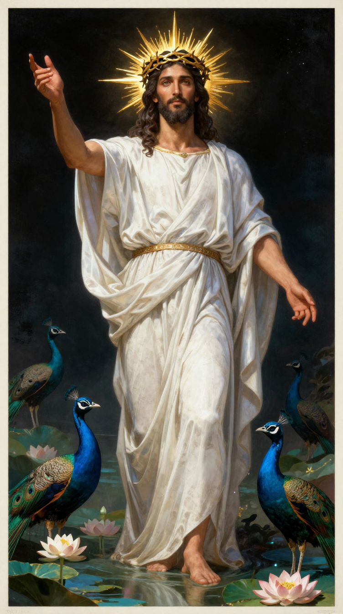</td>
  </tr>
  <tr>
    <td>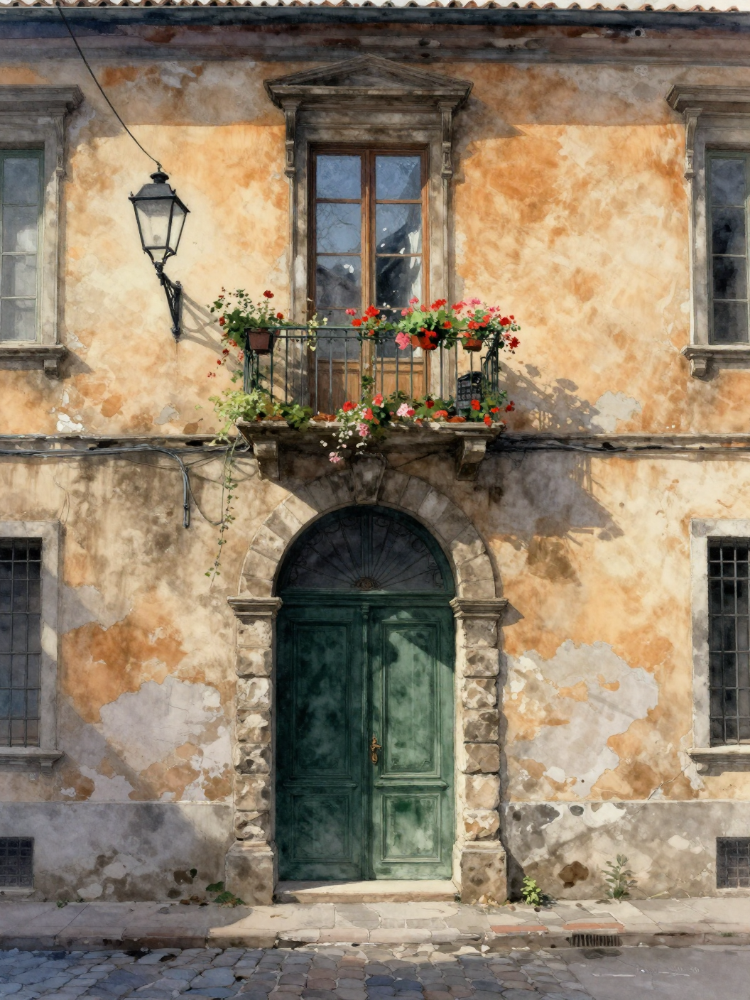</td>
    <td>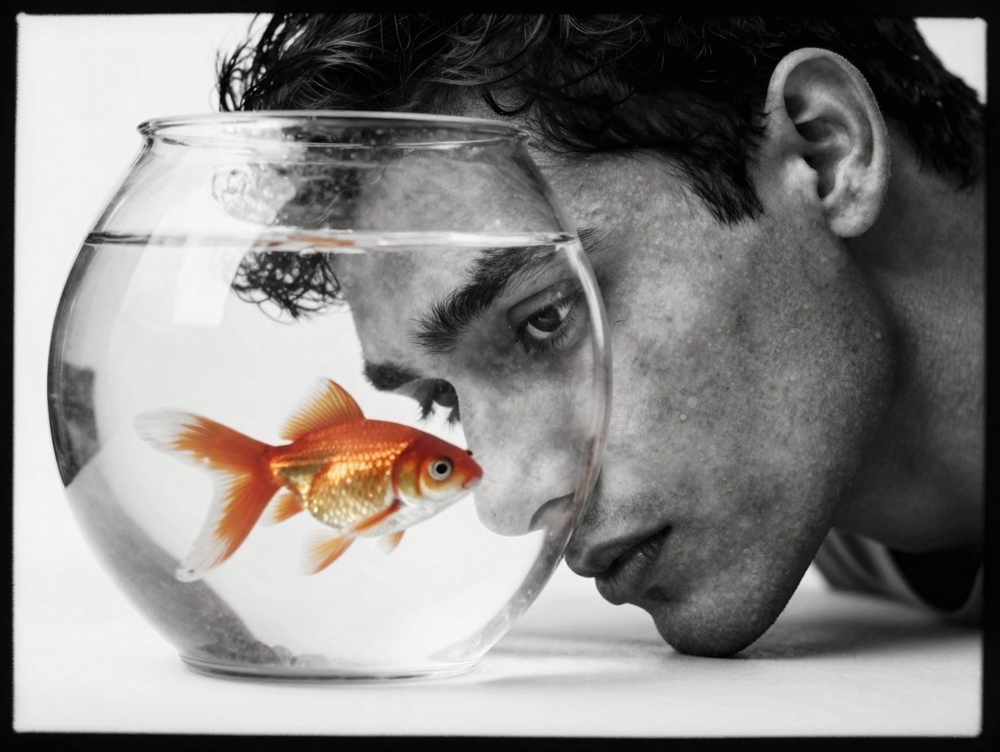</td>
    <td>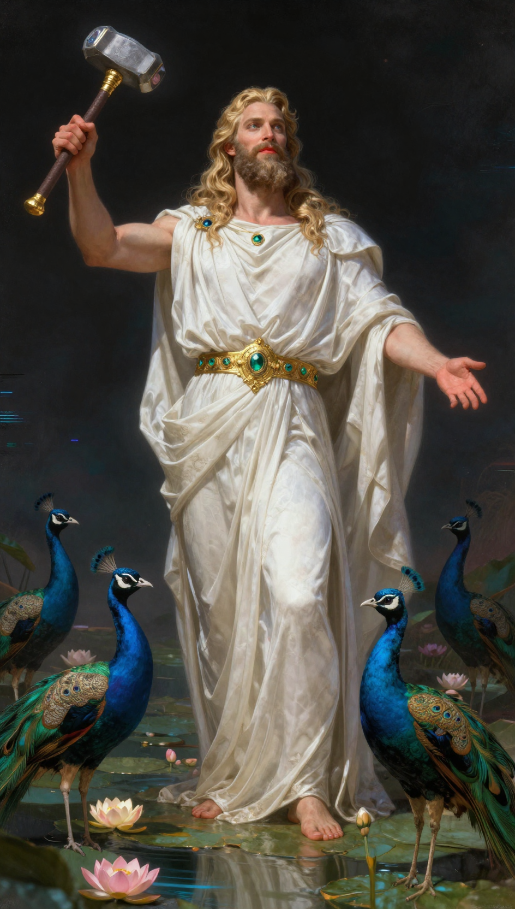</td>
  </tr>
</table>

### Showcase with Prompts

<table>
  <tr>
    <td width="300"></td>
    <td><i>"Kagekiyachi art style., watercolor urban street scene featuring a vintage red tram gliding along wet cobblestone tracks under autumnal yellow trees; intricate overhead wires crisscross above historic European buildings with ornate facades and a spired tower in the background; pedestrians stroll leisurely on sidewalks lined with lampposts and shop awnings; soft diffused light casts gentle shadows across the scene, evoking nostalgic charm reminiscent of early 20th-century city life rendered with delicate brushstrokes, warm earth tones, and subtle texture blending characteristic of Akiya Kageichi's aesthetic."</i><br><br></td>
  </tr>
  <tr>
    <td width="300">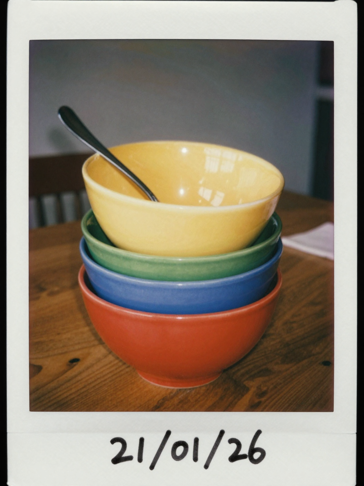</td>
    <td><i>"The image is a Polaroid photograph featuring a stack of colorful bowls and a spoon on a wooden table.

The main subject is a stack of four bowls, each of a different color. From top to bottom, the bowls are yellow, orange, green, blue, and red. The colors are solid and vibrant, giving a retro feel to the image. A silver spoon rests inside the top yellow bowl, with the handle extending diagonally towards the top left.

The bowls are centered in the frame, taking up a significant portion of the image. They are positioned on a dark, wooden table. The table's wood grain is visible, adding texture and warmth to the scene. The composition is simple, with the bowls being the primary focus.

In the background, there is a hint of the surrounding environment. To the left, a dark wooden chair is partially visible. To the right, a folded napkin or piece of cloth is seen. The walls appear to be a neutral color, likely cream or light gray. The lighting seems to be soft and indirect, casting gentle shadows. There are some light reflections across the background suggesting a window or other light source.

The image has a vintage aesthetic, due to the Polaroid format with the characteristic white border. The date "21/01/26" is hand written at the bottom right corner of the border, reinforcing the sense of nostalgia. The overall mood is calm and inviting, with the bright colors of the bowls creating a cheerful atmosphere.medium film grain"</i><br><br></td>
  </tr>
  <tr>
    <td width="300">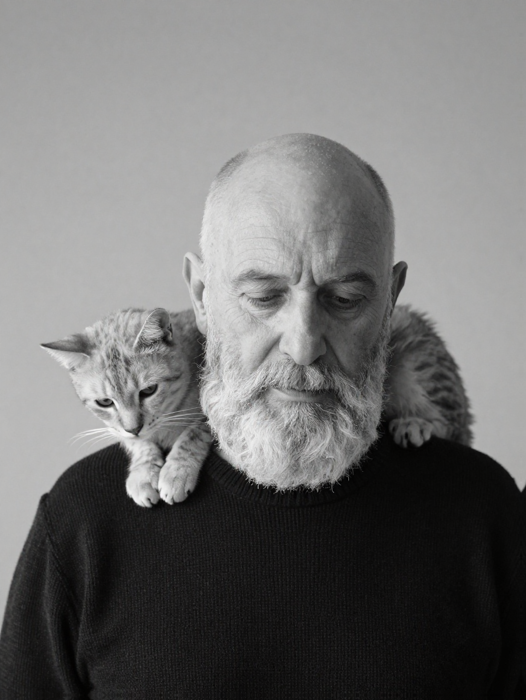</td>
    <td><i>"A contemplative black and white studio portrait features an elderly man with a bald head and a prominent, full white beard. His eyes are open or deeply downcast, suggesting introspection or serene rest. He is attired in a dark, possibly black, finely knit sweater with discernible texture. A slender, light-furred cat, exhibiting subtle tabby patterns, is comfortably draped across his shoulders and neck. The cat's head is lowered, resting gently on the man's left shoulder, its gaze directed downwards. The lighting is soft and diffused, creating subtle shadows that enhance the contours of their faces and the textures of the man's beard and sweater. The background is a smooth, undifferentiated medium grey, providing a minimalist and timeless backdrop. The composition captures an intimate and tranquil moment, emphasizing the gentle bond between the man and the cat within a classic photographic aesthetic."</i><br><br></td>
  </tr>
  <tr>
    <td width="300">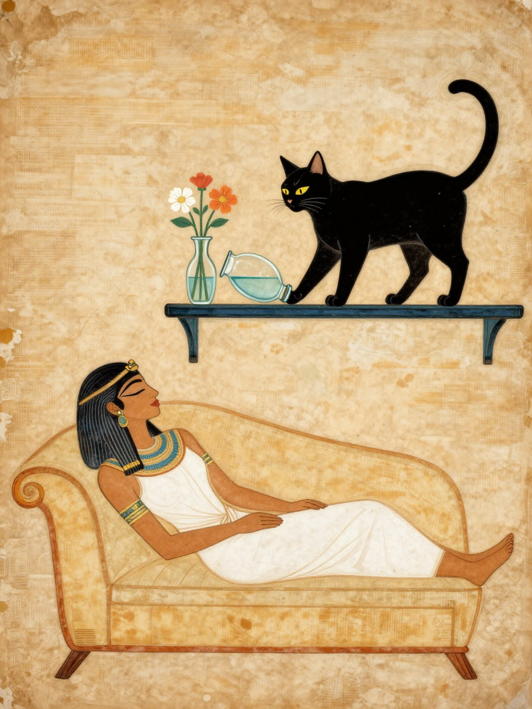</td>
    <td><i>"style: ancient egyptian papyrus drawing on wall, Woman is sleeping with eyes closed on sofa, short shelf above sofa. small glass vase with water with flowers on the shelf right above woman. A black cat is standing on shelf. The cat pushes the vase off shelf with her hand. The vase tilted sideways. the vase about to fall down. The cat looking down with evil smile."</i><br><br></td>
  </tr>
</table>

---

## Features

### Generation Modes

- **Text-to-Image**: Generate images from text descriptions
- **Image-to-Image**: Transform existing images with text guidance
- **Inpainting**: Edit specific regions using masks (white = regenerate, black = preserve)

### Inpainting Options

- **Color Match**: Transfers color/lighting statistics from source to generated regions
- **Blend Edges**: Feathers mask boundaries for seamless transitions
- **Preserve Structure**: Maintains edge contours from the source image
- **Send to Remix**: One-click workflow to instantly send a generated result to the input for iteration
- **Gallery Strip**: Persistent session history at the bottom of the viewport
- **Open Output Folder**: Quick access button 📂 to view your generated files

### Advanced Capabilities

- **Model Selection**: Choose between base or optimized quantized models
- **LoRA Support**: Drop `.safetensors` files into `models/loras/` to dynamically load styles (Experimental)
- **Smart Seed**: Toggle between Random (`-1`) and Fixed seeds with a simple checkbox

### Technical Features

- SDNQ 4-bit quantization (on supported models)
- Automatic aspect ratio detection from source images
- **Styles**: Select from Cinematic, Anime, Cyberpunk, and more for instant aesthetic enhancements
- **2x AI Upscaling**: Integrated Swin2SR for high-quality resolution boosting
- **Invisible Watermarking**: Embeds invisible SynthID-like signatures for authenticity (contains optional Device ID)
- **Metadata Embedding**: Full generation parameters (Prompt, Seed, Steps, Guidance) stored directly in PNG files
- **TF32 Acceleration**: Enabled on Ampere+ GPUs for faster inference

---

## Requirements

- Python 3.10 or higher
- CUDA-compatible GPU with 8GB+ VRAM (recommended)
  - Quantized model can run on 6GB VRAM
- Windows, Linux, or macOS

---

## Agentic & MCP Support
This project is **MCP (Model Context Protocol) Compliant**. 
You can run `Run_MCP.bat` or configure your agent (like Claude Desktop) to use `mcp_server.py` to:
- Generate images via text prompt
- Upscale images
- Check device status

## Installation

1. Clone the repository:

```bash
git clone https://github.com/yourusername/processed-electric-sheep-dreams.git
cd processed-electric-sheep-dreams
```

2. Create and activate a virtual environment:

```bash
python -m venv venv
venv\Scripts\activate  # Windows
source venv/bin/activate  # Linux/macOS
```

3. Install dependencies:

```bash
pip install -r requirements.txt
```

4. Install PyTorch with CUDA support (if not already installed):

```bash
pip install torch torchvision --index-url https://download.pytorch.org/whl/cu124
```

---

## Quick Start (Windows)

For the easiest experience, just double-click **Launch.bat**. It will:
1. Check for Python installation
2. Create a virtual environment (first run only)
3. Install all dependencies (first run only)
4. Launch the application

> **Note:** First launch takes several minutes to set up. Subsequent launches are fast.

---

## Usage

Launch the application:

```bash
python app.py
```

### Interface Overview

| Tab | Purpose |
|-----|---------|
| CREATE | Text-to-Image generation with aspect ratio presets |
| REMIX | Image-to-Image transformation and Inpainting |
| 📂 Folder | Opens the local directory containing your generated images |
| ↦ REMIX | (Overlay) Sends the current result to the REMIX tab for editing |

### Generation Parameters

| Parameter | Description | Default |
|-----------|-------------|---------|
| **Model** | Choose base or optimized quantized model | Tongyi-MAI/Z-Image-Turbo |
| Prompt | Text description of desired image | Required |
| Negative Prompt | Elements to exclude from generation | Optional |
| Steps | Number of inference steps | 9 |
| Guidance Scale | CFG scale (0.0 recommended for turbo) | 0.0 |
| Strength | Transformation intensity for Img2Img | 0.40 |
| Seed | Random (-1) or Fixed Integer (toggle with checkbox) | -1 |
| LoRA | Select a loaded LoRA model from the dropdown | None |

### Inpainting Workflow

1. Switch to the REMIX tab
2. Upload a reference image
3. Upload a mask image (white areas will be regenerated)
4. Enter a prompt describing what to generate in masked areas
5. Adjust strength and enable desired post-processing options
6. Click "INITIATE RENDER"

---

## Project Structure

```
processed-electric-sheep-dreams/
├── app.py           # GUI application (ttkbootstrap)
├── backend.py       # Image generation engine
├── mcp_server.py    # MCP server for agentic access
├── requirements.txt # Python dependencies
├── Launch.bat       # One-click launcher (Windows)
└── README.md        # This file
```

---

## Model Information

This application supports multiple models with easy switching:

### Base Model (Default)
**[Tongyi-MAI/Z-Image-Turbo](https://huggingface.co/Tongyi-MAI/Z-Image-Turbo)**
- Full precision model optimized for Z-Image architecture
- Excellent quality and versatility
- ~5GB download size

### Optimized Quantized Model
**[Abrahamm3r/Z-Image-SDNQ-uint4-svd-r32](https://huggingface.co/Abrahamm3r/Z-Image-SDNQ-uint4-svd-r32)**
- 4-bit SDNQ quantization with SVD rank-32 optimization
- ~40% smaller download and VRAM footprint
- Minimal quality loss, maximum efficiency
- Created by [@Abrahamm3r](https://huggingface.co/Abrahamm3r)

Models are automatically downloaded on first run. The application intelligently applies SDNQ optimizations only when using quantized models.

### Performance Notes

- First generation may be slower due to model initialization
- Generation speed depends on resolution and GPU capability
- Lower dimensions (1024x1024) generate faster than higher resolutions
- Quantized model offers ~25% faster loading with minimal quality difference
- **LoRA Note**: The quantized model uses int4 precision. Some standard fp16 LoRAs may not apply correctly or may degrade quality. This feature is experimental.

---

## Troubleshooting

### Common Issues

**"Height must be divisible by 16"**
- Adjust dimensions to multiples of 16 (e.g., 1024, 1280, 1536)

**CUDA out of memory**
- Switch to the quantized model (Abrahamm3r/Z-Image-SDNQ-uint4-svd-r32)
- Reduce output resolution
- Close other GPU-intensive applications
- The application uses CPU offload to minimize VRAM requirements

**Slow generation**
- Ensure CUDA is properly installed
- Try the optimized quantized model
- Lower the number of inference steps
- Reduce image resolution

---

## License

This project is provided as-is for educational and personal use. The underlying models may have their own licensing terms.

---

## Acknowledgments & Citations

### Base Model
- **[Z-Image-Turbo](https://huggingface.co/Tongyi-MAI/Z-Image-Turbo)** by Tongyi-MAI
  - Original Z-Image architecture optimized for speed

### Quantized Model
- **[Z-Image-SDNQ-uint4-svd-r32](https://huggingface.co/Abrahamm3r/Z-Image-SDNQ-uint4-svd-r32)** by [@Abrahamm3r](https://huggingface.co/Abrahamm3r)
  - 4-bit SDNQ quantization with SVD rank-32 optimization
  - Enables efficient inference on consumer GPUs

### Quantization Framework
- **[Disty0/Z-Image-Turbo-SDNQ-uint4-svd-r32](https://huggingface.co/Disty0/Z-Image-Turbo-SDNQ-uint4-svd-r32)** by Disty0
  - Original SDNQ quantization methodology

### Infrastructure & Tools
- **[Diffusers](https://github.com/huggingface/diffusers)** by Hugging Face
  - Diffusion model pipeline framework
- **[SDNQ](https://github.com/huggingface/sdnq)** for quantization support
  - Structured Differentiable Neural Quantization
- **[Swin2SR](https://huggingface.co/caidas/swin2SR-classical-sr-x2-64)** for upscaling
  - AI-powered 2x super-resolution
