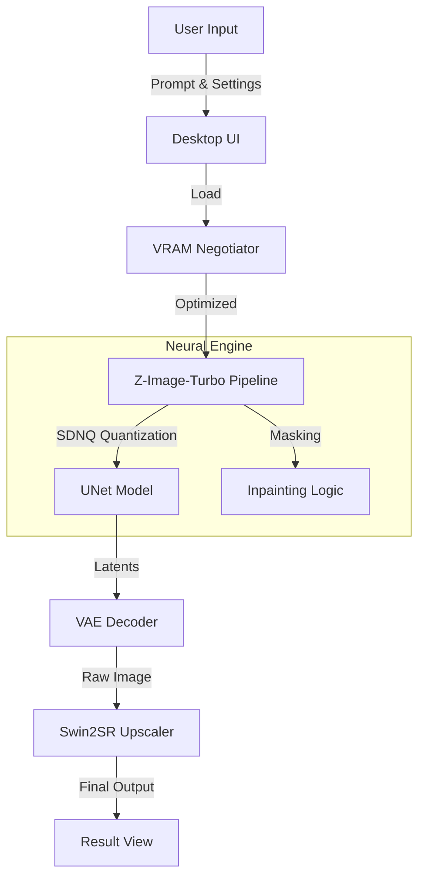

# Processed Electric Sheep Dreams


A native desktop application for fast AI image generation using a highly optimized Z-Image-Turbo model with SDNQ quantization. Supports Text-to-Image, Image-to-Image transformation, and Inpainting with mask-based editing.


With accurate text and subject rendering. Includes a MOAP (Mother of All (negative) Prompts) for better rendering.

---

## ⌨️ Shortcuts

| Key | Action |
|-----|--------|
| `Enter` | Trigger generation (when in prompt box) |
| `Ctrl+S` | Save generated image |
| `Ctrl+C` | Copy prompt to clipboard |
| `Esc` | Cancel current generation |
| `Scroll` | Zoom in/out of viewport |

---

## Screenshots

### Main Interface


### Prompt Entry with Advanced Configuration


### Generated Result


---

## Gallery

Sample images generated with Processed Electric Sheep Dreams:

<table>
  <tr>
    <td></td>
    <td></td>
    <td></td>
  </tr>
  <tr>
    <td></td>
    <td></td>
    <td></td>
  </tr>
</table>

### Showcase with Prompts

<table>
  <tr>
    <td width="300"></td>
    <td><i>"Kagekiyachi art style., watercolor urban street scene featuring a vintage red tram gliding along wet cobblestone tracks under autumnal yellow trees; intricate overhead wires crisscross above historic European buildings with ornate facades and a spired tower in the background; pedestrians stroll leisurely on sidewalks lined with lampposts and shop awnings; soft diffused light casts gentle shadows across the scene, evoking nostalgic charm reminiscent of early 20th-century city life rendered with delicate brushstrokes, warm earth tones, and subtle texture blending characteristic of Akiya Kageichi's aesthetic."</i></td>
  </tr>
  <tr>
    <td width="300"></td>
    <td><i>"The image is a Polaroid photograph featuring a stack of colorful bowls and a spoon on a wooden table.

The main subject is a stack of four bowls, each of a different color. From top to bottom, the bowls are yellow, orange, green, blue, and red. The colors are solid and vibrant, giving a retro feel to the image. A silver spoon rests inside the top yellow bowl, with the handle extending diagonally towards the top left.

The bowls are centered in the frame, taking up a significant portion of the image. They are positioned on a dark, wooden table. The table's wood grain is visible, adding texture and warmth to the scene. The composition is simple, with the bowls being the primary focus.

In the background, there is a hint of the surrounding environment. To the left, a dark wooden chair is partially visible. To the right, a folded napkin or piece of cloth is seen. The walls appear to be a neutral color, likely cream or light gray. The lighting seems to be soft and indirect, casting gentle shadows. There are some light reflections across the background suggesting a window or other light source.

The image has a vintage aesthetic, due to the Polaroid format with the characteristic white border. The date "21/01/26" is hand written at the bottom right corner of the border, reinforcing the sense of nostalgia. The overall mood is calm and inviting, with the bright colors of the bowls creating a cheerful atmosphere.medium film grain"</i></td>
  </tr>
  <tr>
    <td width="300"></td>
    <td><i>"A contemplative black and white studio portrait features an elderly man with a bald head and a prominent, full white beard. His eyes are open or deeply downcast, suggesting introspection or serene rest. He is attired in a dark, possibly black, finely knit sweater with discernible texture. A slender, light-furred cat, exhibiting subtle tabby patterns, is comfortably draped across his shoulders and neck. The cat's head is lowered, resting gently on the man's left shoulder, its gaze directed downwards. The lighting is soft and diffused, creating subtle shadows that enhance the contours of their faces and the textures of the man's beard and sweater. The background is a smooth, undifferentiated medium grey, providing a minimalist and timeless backdrop. The composition captures an intimate and tranquil moment, emphasizing the gentle bond between the man and the cat within a classic photographic aesthetic."</i><br><br></td>
  </tr>
</table>

---

## Features

### Generation Modes

- **Text-to-Image**: Generate images from text descriptions
- **Image-to-Image**: Transform existing images with text guidance
- **Inpainting**: Edit specific regions using masks (white = regenerate, black = preserve)

### Inpainting Options

- **Color Match**: Transfers color/lighting statistics from source to generated regions
- **Blend Edges**: Feathers mask boundaries for seamless transitions
- **Preserve Structure**: Maintains edge contours from the source image

### Technical Features

- SDNQ 4-bit quantization for efficient VRAM usage
- Automatic aspect ratio detection from source images
- 2x AI upscaling using Swin2SR (optional)
- Negative prompt presets for common use cases
- TF32 acceleration on Ampere+ GPUs

---

## Requirements

- Python 3.10 or higher
- CUDA-compatible GPU with 8GB+ VRAM (recommended)
- Windows, Linux, or macOS

---

## Installation

1. Clone the repository:

```bash
git clone https://github.com/yourusername/processed-electric-sheep-dreams.git
cd processed-electric-sheep-dreams
```

2. Create and activate a virtual environment:

```bash
python -m venv venv
venv\Scripts\activate  # Windows
source venv/bin/activate  # Linux/macOS
```

3. Install dependencies:

```bash
pip install -r requirements.txt
```

4. Install PyTorch with CUDA support (if not already installed):

```bash
pip install torch torchvision --index-url https://download.pytorch.org/whl/cu124
```

---

## Quick Start (Windows)

For the easiest experience, just double-click **Launch.bat**. It will:
1. Check for Python installation
2. Create a virtual environment (first run only)
3. Install all dependencies (first run only)
4. Launch the application

> **Note:** First launch takes several minutes to set up. Subsequent launches are fast.

---

## Usage

Launch the application:

```bash
python app.py
```

### Interface Overview

| Tab | Purpose |
|-----|---------|
| CREATE | Text-to-Image generation with aspect ratio presets |
| REMIX | Image-to-Image transformation and Inpainting |

### Generation Parameters

| Parameter | Description | Default |
|-----------|-------------|---------|
| Prompt | Text description of desired image | Required |
| Negative Prompt | Elements to exclude from generation | Optional |
| Steps | Number of inference steps | 9 |
| Guidance Scale | CFG scale (0.0 recommended for turbo) | 0.0 |
| Strength | Transformation intensity for Img2Img | 0.40 |
| Seed | Random seed (-1 for random) | -1 |

### Inpainting Workflow

1. Switch to the REMIX tab
2. Upload a reference image
3. Upload a mask image (white areas will be regenerated)
4. Enter a prompt describing what to generate in masked areas
5. Adjust strength and enable desired post-processing options
6. Click "INITIATE RENDER"

---

## Project Structure

```
processed-electric-sheep-dreams/
├── app.py           # GUI application (ttkbootstrap)
├── backend.py       # Image generation engine
├── requirements.txt # Python dependencies
└── README.md        # This file
```

---

## Model Information

This application uses the [Z-Image-Turbo](https://huggingface.co/Disty0/Z-Image-Turbo-SDNQ-uint4-svd-r32) model with SDNQ 4-bit quantization. The model is automatically downloaded on first run (~5GB).

### Performance Notes

- First generation may be slower due to model initialization
- Generation speed depends on resolution and GPU capability
- Lower dimensions (1024x1024) generate faster than higher resolutions

---

## Troubleshooting

### Common Issues

**"Height must be divisible by 16"**
- Adjust dimensions to multiples of 16 (e.g., 1024, 1280, 1536)

**CUDA out of memory**
- Reduce output resolution
- Close other GPU-intensive applications
- The application uses CPU offload to minimize VRAM requirements

**Slow generation**
- Ensure CUDA is properly installed
- Lower the number of inference steps
- Reduce image resolution

---

## License

This project is provided as-is for educational and personal use. The underlying Z-Image-Turbo model may have its own licensing terms.

---

## Acknowledgments

- [Z-Image-Turbo](https://huggingface.co/Disty0/Z-Image-Turbo-SDNQ-uint4-svd-r32) by Disty0
- [Diffusers](https://github.com/huggingface/diffusers) by Hugging Face
- [SDNQ](https://github.com/huggingface/sdnq) for quantization support
- [Swin2SR](https://huggingface.co/caidas/swin2SR-classical-sr-x2-64) for upscaling
